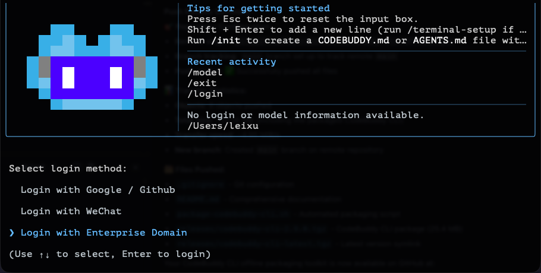
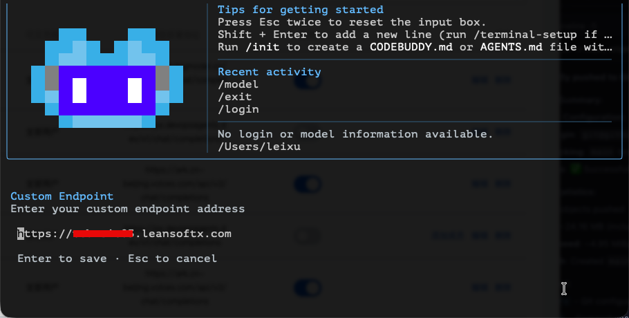
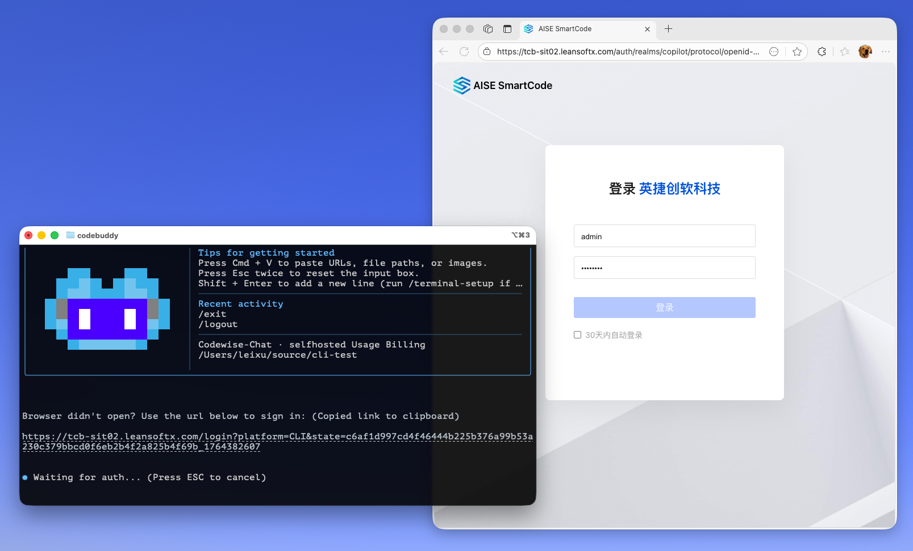
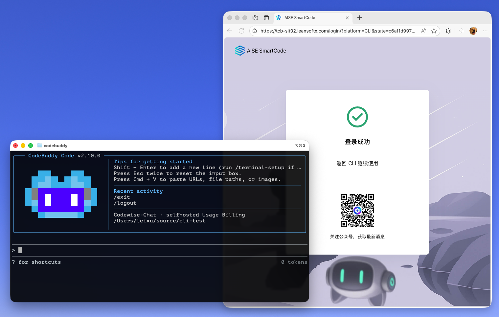
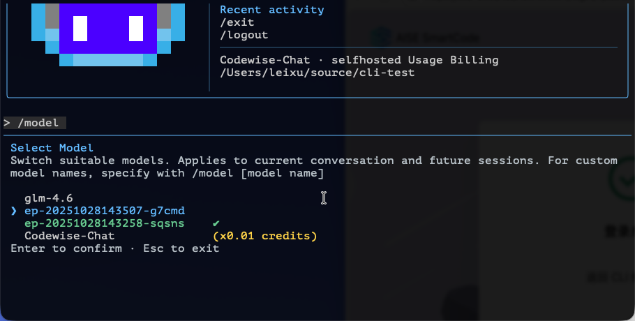

# 如何在私有化环境中使用 CodeBuddy CLI

私有化环境中使用 CodeBuddy CLI 需要完成几个步骤：

1. 安装 CodeBuddy CLI
2. 配置 CodeBuddy CLI
3. 使用 CodeBuddy CLI

## 1. 安装 CodeBuddy CLI

clone 本仓库，或者直接下载 releases 目录中的对应版本，然后运行以下指令

```bash
npm install -g ./codebuddy-cli-{version}.tgz
```

## 2. 配置 CodeBuddy CLI

直接使用 `codebuddy` 指令启动 cli，进入如下界面



选择 `Login with Enterprise Domain` 然后输入企业私有化CodeBuddy服务器地址，示例如下：

 

正确输入后，会自动跳转到登录页面，输入用户名和密码：



登录成功后，会自动跳转到主页面，如下图所示：



## 3. 使用 CodeBuddy CLI

使用 `/model` 指令查看模型列表



所列出的模型就是私有化环境中可用的模型。

选择模型后即可正常使用 CodeBuddy Code。

---

版权所有 © leansoftx.com 2025
